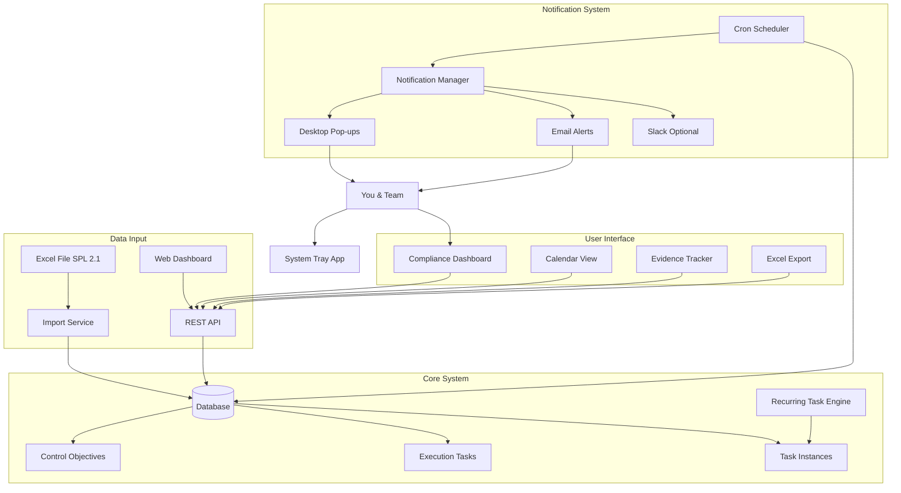

# Data Security & Privacy Activity Tracker - Implementation Plan

## Executive Summary

Based on your Excel file structure, this is a **Compliance Control Execution Tracker** for managing Data Security & Privacy (DS&P) activities. The system needs to handle:

- **Control Objectives** with multiple execution tasks
- **Mixed Frequencies**: Event-driven, Monthly, Quarterly, Annually, Ongoing
- **Multiple Due Dates** per control (e.g., 12 monthly instances)
- **Team Assignments**: DPE, PM, SE roles
- **Evidence Management**: Links to IBM OneDrive storage
- **Completion Tracking**: Planned vs Actual dates

## Your Excel Structure Analysis

### Column Breakdown

| Column | Purpose | Example Values |
|--------|---------|----------------|
| **Control Objective** | High-level control goal | "Review risk log with management" |
| **Control Execution Tasks** | Detailed task description + guidance | "On a scheduled basis, review..." |
| **Control Guidance** | Reference code | "RSK 3.1", "INV 1.1" |
| **Frequency - Event Driven** | Trigger conditions | "When there is a change in project phase" |
| **Frequency - Scheduled** | Regular schedule | "Monthly", "Quarterly", "Annually", "Ongoing" |
| **Planned Completion Date** | Target deadline | "15-Feb-26" or multiple dates |
| **Actual Completion Date** | When completed | "6-Feb-26" or "Jan'26: No change" |
| **Assigned to** | Responsible team members | "DPE, PM, SE" |
| **Evidence storage location** | Where proof is stored | "IBM OneDrive" |

### Key Patterns Identified

1. **Hierarchical Structure**: One Control Objective → Multiple Execution Tasks
2. **Recurring Tasks**: Monthly tasks create 12 rows (Jan-Dec), Quarterly creates 4 rows
3. **Flexible Due Dates**: Can be single date or multiple dates (comma-separated)
4. **Status Tracking**: Actual completion shows both date and notes ("No change")
5. **Role-Based**: Multiple team members per task

## Recommended Solution: Hybrid Web + Desktop System

### Why Hybrid?

| Requirement | Web Dashboard | Desktop Notifications | Hybrid ✅ |
|-------------|---------------|----------------------|-----------|
| Manage multiple controls | ✅ Excellent | ❌ Difficult | ✅ Excellent |
| Track recurring tasks | ✅ Built-in | ⚠️ Manual | ✅ Built-in |
| Excel import/export | ✅ Easy | ⚠️ Manual | ✅ Easy |
| Never miss deadlines | ❌ Email only | ✅ Native pop-ups | ✅ Both |
| Team collaboration | ✅ Yes | ❌ Limited | ✅ Yes |
| Evidence links | ✅ Clickable | ❌ Text only | ✅ Clickable |
| Compliance reporting | ✅ Dashboard | ❌ None | ✅ Dashboard |

## System Architecture



## Data Model Design

### 1. Control Objectives Table
```typescript
interface ControlObjective {
  id: string;
  title: string;                    // "Review risk log with management"
  description: string;               // Full guidance text
  controlCode: string;               // "RSK 3.1"
  category: string;                  // "Risk Management", "Inventory", etc.
  createdAt: Date;
  updatedAt: Date;
}
```

### 2. Execution Tasks Table
```typescript
interface ExecutionTask {
  id: string;
  controlObjectiveId: string;        // Foreign key
  description: string;               // Task details
  frequencyType: 'event-driven' | 'scheduled' | 'both';
  eventTrigger?: string;             // "When there is a change..."
  scheduledFrequency?: 'monthly' | 'quarterly' | 'annually' | 'ongoing';
  assignedTo: string[];              // ["DPE", "PM", "SE"]
  evidenceLocation: string;          // "IBM OneDrive"
  isActive: boolean;
}
```

### 3. Task Instances Table (Individual Occurrences)
```typescript
interface TaskInstance {
  id: string;
  executionTaskId: string;           // Foreign key
  instanceLabel: string;             // "Jan'26", "Q1'26"
  plannedDate: Date;                 // 15-Feb-26
  actualDate?: Date;                 // 6-Feb-26
  status: 'pending' | 'completed' | 'overdue' | 'no-change';
  completionNotes?: string;          // "Jan'26: No change"
  remindersSent: Date[];             // Track notification history
  createdAt: Date;
}
```

### 4. Reminders Table
```typescript
interface Reminder {
  id: string;
  taskInstanceId: string;
  reminderDate: Date;
  sent: boolean;
  sentAt?: Date;
  notificationChannels: ('desktop' | 'email' | 'slack')[];
}
```

## Excel Import Strategy

### Import Process Flow

```mermaid
graph LR
    A[Upload Excel] --> B[Parse File]
    B --> C[Detect Structure]
    C --> D[Group by Control Objective]
    D --> E[Create Control Records]
    E --> F[Create Execution Tasks]
    F --> G[Generate Task Instances]
    G --> H[Calculate Reminders]
    H --> I[Preview & Confirm]
    I --> J[Save to Database]
```



### Handling Complex Patterns

**Pattern 1: Monthly Tasks (12 instances)**
```
Input: "Review risk log with management" - Monthly
Output: 
  - Jan'26 → Planned: 15-Feb-26
  - Feb'26 → Planned: 15-Mar-26
  - ... (12 total instances)
```

**Pattern 2: Quarterly Tasks (4 instances)**
```
Input: "Review risk log with client" - Quarterly
Planned Dates: "31-Mar-26, 30-Jun-26, 30-Sep-26, 31-Dec-26"
Output:
  - Q1'26 → Planned: 31-Mar-26, Actual: 14-Feb-26
  - Q2'26 → Planned: 30-Jun-26, Actual: 19-May-26
  - Q3'26 → Planned: 30-Sep-26
  - Q4'26 → Planned: 31-Dec-26
```

**Pattern 3: Ongoing Tasks (Multiple dates)**
```
Input: "Update Asset inventory" - Ongoing
Planned Dates: "31-Jan-26, 28-Feb-26, 31-Mar-26..."
Output: 12 instances with monthly check-ins
```

**Pattern 4: Event-Driven + Scheduled**
```
Input: "Client approval of IT asset inventory"
Event: "Yearly or if there is a change..."
Scheduled: Quarterly
Output: 4 quarterly instances + ability to add ad-hoc instances
```

## Notification Strategy

### Reminder Schedule

Based on your compliance needs, here's the notification strategy:

| Days Before Due | Notification Type | Channels | Priority |
|-----------------|-------------------|----------|----------|
| **30 days** | Early warning | Email | Low |
| **14 days** | First reminder | Desktop + Email | Medium |
| **7 days** | Second reminder | Desktop + Email | High |
| **3 days** | Urgent reminder | Desktop + Email + Slack | High |
| **1 day** | Final warning | Desktop + Email + Slack | Critical |
| **Due date** | Due today | Desktop + Email + Slack | Critical |
| **Overdue** | Daily reminders | Desktop + Email + Slack | Critical |

### Smart Notification Logic

```typescript
interface NotificationRule {
  daysBeforeDue: number;
  channels: ('desktop' | 'email' | 'slack')[];
  priority: 'low' | 'medium' | 'high' | 'critical';
  message: string;
}

const rules: NotificationRule[] = [
  {
    daysBeforeDue: 30,
    channels: ['email'],
    priority: 'low',
    message: 'Upcoming: {task} due in 30 days'
  },
  {
    daysBeforeDue: 14,
    channels: ['desktop', 'email'],
    priority: 'medium',
    message: '⚠️ Reminder: {task} due in 2 weeks'
  },
  {
    daysBeforeDue: 7,
    channels: ['desktop', 'email'],
    priority: 'high',
    message: '🔔 Important: {task} due in 1 week'
  },
  {
    daysBeforeDue: 3,
    channels: ['desktop', 'email', 'slack'],
    priority: 'high',
    message: '⚠️ Urgent: {task} due in 3 days'
  },
  {
    daysBeforeDue: 1,
    channels: ['desktop', 'email', 'slack'],
    priority: 'critical',
    message: '🚨 Critical: {task} due tomorrow'
  },
  {
    daysBeforeDue: 0,
    channels: ['desktop', 'email', 'slack'],
    priority: 'critical',
    message: '🚨 DUE TODAY: {task}'
  }
];
```

### Desktop Notification Example

```
🔔 Compliance Task Due Soon

Control: Review risk log with management
Task: Feb'26 Monthly Review
Due: 15-Mar-26 (3 days remaining)
Assigned: DPE, PM, SE

[View Details] [Mark Complete] [Snooze]
```

## Web Dashboard Features

### 1. Compliance Overview Dashboard

```
┌─────────────────────────────────────────────────────────┐
│  DS&P Activity Tracker Dashboard                        │
├─────────────────────────────────────────────────────────┤
│                                                          │
│  📊 Summary                                              │
│  ┌──────────┬──────────┬──────────┬──────────┐         │
│  │ Overdue  │ Due Soon │ Upcoming │ Complete │         │
│  │    3     │    7     │    15    │    42    │         │
│  └──────────┴──────────┴──────────┴──────────┘         │
│                                                          │
│  🎯 By Control Category                                 │
│  ┌─────────────────────────────────────────┐           │
│  │ Risk Management (RSK)        ████░░ 80%  │           │
│  │ Inventory (INV)              ███░░░ 60%  │           │
│  │ Data Protection (DIP)        █████░ 90%  │           │
│  └─────────────────────────────────────────┘           │
│                                                          │
│  📅 This Week's Tasks                                   │
│  ┌─────────────────────────────────────────┐           │
│  │ ⚠️ Review risk log - Feb'26              │           │
│  │    Due: 15-Mar-26 (3 days)               │           │
│  │    Assigned: DPE, PM, SE                 │           │
│  │    [Complete] [View Evidence]            │           │
│  ├─────────────────────────────────────────┤           │
│  │ 🔔 Update Asset inventory - Mar'26       │           │
│  │    Due: 31-Mar-26 (13 days)              │           │
│  │    Assigned: PM, SE                      │           │
│  │    [Complete] [View Evidence]            │           │
│  └─────────────────────────────────────────┘           │
└─────────────────────────────────────────────────────────┘
```

### 2. Calendar View

- **Monthly View**: Shows all tasks for the month
- **Color Coding**: 
  - 🔴 Overdue
  - 🟠 Due this week
  - 🟡 Due this month
  - 🟢 Completed
- **Click to View**: Task details and evidence links

### 3. Control Objectives View

```
Control Objective: Review risk log with management
Code: RSK 3.1
Category: Risk Management

Execution Tasks:
├─ Monthly Management Review
│  ├─ Jan'26 ✅ Completed (6-Feb-26)
│  ├─ Feb'26 ✅ Completed (6-Mar-26)
│  ├─ Mar'26 ✅ Completed (13-Apr-26)
│  ├─ Apr'26 ✅ Completed (19-May-26)
│  ├─ May'26 ⚠️ Due: 15-Jun-26 (27 days)
│  ├─ Jun'26 📅 Due: 15-Jul-26
│  └─ ... (6 more)
```

### 4. Evidence Management

- **Link Storage**: Store OneDrive/SharePoint links
- **Quick Access**: Click to open evidence location
- **Upload Status**: Track if evidence is uploaded
- **Audit Trail**: Who uploaded, when

### 5. Team View

```
Assigned to: DPE

Your Tasks:
├─ Overdue (1)
│  └─ Test TOMs - Annually (Due: 31-May-26)
├─ Due This Week (2)
│  ├─ Review risk log - May'26
│  └─ Client approval - Q2'26
└─ Upcoming (8)
```

## Excel Export Functionality

### Export Options

1. **Full Export**: Complete tracker with all data
2. **Status Report**: Summary of completed vs pending
3. **Overdue Report**: All overdue tasks
4. **Monthly Report**: Tasks for specific month
5. **Control-Specific**: Export single control objective

### Export Format

Maintains original Excel structure:
- Same column headers
- Grouped by Control Objective
- Multiple rows for recurring tasks
- Preserves actual completion dates and notes

## Technology Stack

### Backend
- **Runtime**: Node.js 20+
- **Framework**: Express.js
- **Language**: TypeScript
- **Database**: PostgreSQL (better for complex queries) or SQLite (simpler)
- **Excel Processing**: xlsx or exceljs
- **Scheduler**: node-cron
- **Email**: Nodemailer

### Frontend
- **Framework**: React 18 + TypeScript
- **Build Tool**: Vite
- **UI Library**: Material-UI or Ant Design (for professional look)
- **Calendar**: FullCalendar or react-big-calendar
- **Date Handling**: date-fns or dayjs
- **State Management**: React Context or Zustand

### Desktop Agent
- **Runtime**: Node.js
- **Notifications**: node-notifier
- **System Tray**: electron or node-systray
- **Auto-sync**: Polls API every hour

### Optional Integrations
- **Slack**: @slack/bolt
- **Microsoft Teams**: @microsoft/teams-js (if needed)

## Project Structure

```
compliance-tracker/
├── backend/
│   ├── src/
│   │   ├── database/
│   │   │   ├── db.ts
│   │   │   ├── migrations/
│   │   │   └── seeds/
│   │   ├── models/
│   │   │   ├── ControlObjective.ts
│   │   │   ├── ExecutionTask.ts
│   │   │   ├── TaskInstance.ts
│   │   │   └── Reminder.ts
│   │   ├── services/
│   │   │   ├── controlService.ts
│   │   │   ├── taskService.ts
│   │   │   ├── recurringTaskService.ts
│   │   │   ├── reminderService.ts
│   │   │   ├── notificationService.ts
│   │   │   └── excelService.ts
│   │   ├── routes/
│   │   │   ├── controls.ts
│   │   │   ├── tasks.ts
│   │   │   ├── reminders.ts
│   │   │   ├── import.ts
│   │   │   └── export.ts
│   │   ├── scheduler/
│   │   │   └── reminderScheduler.ts
│   │   └── index.ts
│   ├── package.json
│   └── tsconfig.json
├── frontend/
│   ├── src/
│   │   ├── components/
│   │   │   ├── Dashboard/
│   │   │   │   ├── ComplianceOverview.tsx
│   │   │   │   ├── TaskSummary.tsx
│   │   │   │   └── CategoryProgress.tsx
│   │   │   ├── Calendar/
│   │   │   │   ├── CalendarView.tsx
│   │   │   │   └── TaskCalendar.tsx
│   │   │   ├── Controls/
│   │   │   │   ├── ControlList.tsx
│   │   │   │   ├── ControlDetail.tsx
│   │   │   │   └── ExecutionTaskList.tsx
│   │   │   ├── Tasks/
│   │   │   │   ├── TaskCard.tsx
│   │   │   │   ├── TaskForm.tsx
│   │   │   │   └── TaskTimeline.tsx
│   │   │   ├── Import/
│   │   │   │   ├── ExcelImport.tsx
│   │   │   │   ├── ImportPreview.tsx
│   │   │   │   └── ColumnMapper.tsx
│   │   │   └── Export/
│   │   │       └── ExportDialog.tsx
│   │   ├── services/
│   │   │   └── api.ts
│   │   ├── types/
│   │   │   └── index.ts
│   │   ├── App.tsx
│   │   └── main.tsx
│   ├── package.json
│   └── vite.config.ts
├── desktop-agent/
│   ├── src/
│   │   ├── notifier.ts
│   │   ├── trayApp.ts
│   │   └── index.ts
│   └── package.json
├── docker-compose.yml
└── README.md
```

## Implementation Phases

### Phase 1: Core Backend (Week 1)
- [x] Set up Express + TypeScript project
- [x] Design and implement database schema
- [x] Create models for Control Objectives, Execution Tasks, Task Instances
- [x] Build CRUD APIs for all entities
- [x] Implement basic authentication (if needed)

### Phase 2: Excel Import/Export (Week 1-2)
- [x] Build Excel parser for your specific format
- [x] Implement grouping logic (Control Objective → Tasks)
- [x] Handle multiple date formats
- [x] Create recurring task generator
- [x] Build Excel export with original format
- [x] Add import preview and validation

### Phase 3: Recurring Task Engine (Week 2)
- [x] Implement frequency calculation logic
- [x] Generate monthly instances (12 per year)
- [x] Generate quarterly instances (4 per year)
- [x] Generate annual instances
- [x] Handle ongoing tasks
- [x] Support event-driven task creation

### Phase 4: Notification System (Week 2-3)
- [x] Build reminder calculation service
- [x] Implement notification scheduler
- [x] Create email notification channel
- [x] Add desktop notification support
- [x] Implement notification logging
- [x] Add Slack integration (optional)

### Phase 5: Frontend Dashboard (Week 3-4)
- [x] Set up React + Vite project
- [x] Build compliance overview dashboard
- [x] Create calendar view
- [x] Implement control objectives list
- [x] Build task management UI
- [x] Add evidence link management
- [x] Create team/assignment views

### Phase 6: Desktop Agent (Week 4)
- [x] Build desktop notification agent
- [x] Create system tray application
- [x] Implement auto-sync with backend
- [x] Add quick actions (mark complete, snooze)
- [x] Set up auto-start on system boot

### Phase 7: Testing & Deployment (Week 4-5)
- [x] Import your actual Excel file
- [x] Test all notification scenarios
- [x] Verify recurring task generation
- [x] Test Excel export
- [x] User acceptance testing
- [x] Deploy to production
- [x] Create user documentation

## Key Features Summary

### ✅ Must-Have Features
1. **Excel Import**: Parse your SPL 2.1 format exactly
2. **Recurring Tasks**: Auto-generate monthly/quarterly/annual instances
3. **Smart Notifications**: 10/7/3/1 day reminders
4. **Desktop Pop-ups**: Never miss a deadline
5. **Evidence Tracking**: Link to IBM OneDrive
6. **Team Assignments**: DPE, PM, SE roles
7. **Completion Tracking**: Planned vs Actual dates
8. **Excel Export**: Maintain original format

### 🎯 Nice-to-Have Features
1. **Slack Integration**: Team notifications
2. **Mobile App**: Check tasks on phone
3. **Email Digests**: Daily/weekly summaries
4. **Audit Reports**: Compliance status reports
5. **Custom Reminders**: Per-task notification rules
6. **Bulk Operations**: Update multiple tasks at once
7. **Search & Filter**: Find tasks quickly
8. **Analytics**: Completion rates, trends

## Estimated Timeline

| Phase | Duration | Deliverable |
|-------|----------|-------------|
| Phase 1: Core Backend | 1 week | Working API |
| Phase 2: Excel Import/Export | 1 week | Import your file |
| Phase 3: Recurring Tasks | 3 days | Auto-generate instances |
| Phase 4: Notifications | 1 week | Email + Desktop alerts |
| Phase 5: Frontend | 1.5 weeks | Full dashboard |
| Phase 6: Desktop Agent | 3 days | System tray app |
| Phase 7: Testing & Deploy | 1 week | Production ready |
| **Total** | **5-6 weeks** | **Complete system** |

## Sample Notification Scenarios

### Scenario 1: Monthly Task Due Soon
```
🔔 Compliance Task Reminder

Control: Review risk log with management
Task: May'26 Monthly Review
Code: RSK 3.1

Due Date: 15-Jun-26
Days Remaining: 7 days
Assigned To: DPE, PM, SE

Evidence Location: IBM OneDrive

[Mark Complete] [View Details] [Snooze 2 Days]
```

### Scenario 2: Overdue Task
```
🚨 OVERDUE: Compliance Task

Control: Test, assess and validate TOMs
Task: Annual TOM Assessment
Code: DIP 1.1

Due Date: 31-May-26
Status: 19 days overdue
Assigned To: PM, SE

This task requires immediate attention!

[Mark Complete] [View Details] [Add Note]
```

### Scenario 3: Quarterly Task Upcoming
```
⚠️ Quarterly Task Due Soon

Control: Client approval of IT asset inventory
Task: Q2'26 Approval
Code: INV 2.1.1

Due Date: 30-Jun-26
Days Remaining: 14 days
Assigned To: DPE, PM, SE

Previous Completion: Q1'26 - 14-Feb-26

[Mark Complete] [View Evidence] [Snooze]
```

## Configuration Options

### Notification Settings
```json
{
  "notifications": {
    "enabled": true,
    "channels": {
      "desktop": true,
      "email": true,
      "slack": false
    },
    "schedule": {
      "earlyWarning": 30,
      "firstReminder": 14,
      "secondReminder": 7,
      "urgentReminder": 3,
      "finalWarning": 1,
      "overdueFrequency": "daily"
    },
    "quietHours": {
      "enabled": true,
      "start": "20:00",
      "end": "08:00"
    }
  }
}
```

### Team Settings
```json
{
  "teams": {
    "DPE": {
      "name": "Data Privacy Engineer",
      "email": "dpe@example.com",
      "notificationPreference": "email+desktop"
    },
    "PM": {
      "name": "Project Manager",
      "email": "pm@example.com",
      "notificationPreference": "email"
    },
    "SE": {
      "name": "Security Engineer",
      "email": "se@example.com",
      "notificationPreference": "desktop"
    }
  }
}
```

## Next Steps

1. **Review this plan** and confirm it matches your needs
2. **Clarify any questions** about features or implementation
3. **Prioritize features** (must-have vs nice-to-have)
4. **Decide on deployment** (local, cloud, or hybrid)
5. **Approve to proceed** to implementation in Advanced mode

## Questions for You

1. **Deployment**: Do you want this hosted locally or in the cloud?
2. **Team Size**: How many people will use this system?
3. **Slack**: Do you want Slack integration?
4. **Mobile**: Do you need mobile access?
5. **Customization**: Any specific notification preferences?
6. **Timeline**: Is 5-6 weeks acceptable, or do you need it faster?

---

**Ready to build this?** Once you approve this plan, I can switch to Advanced mode and start implementing the system! 🚀