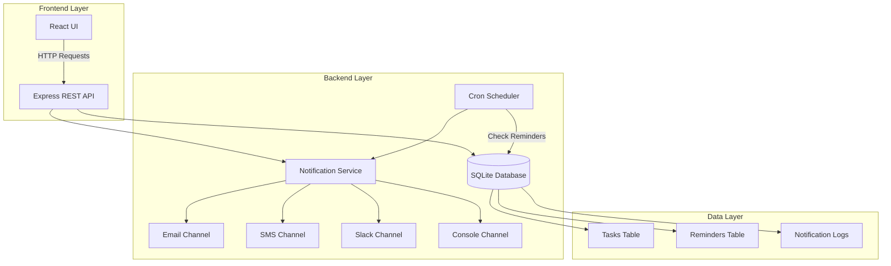

# Task Notifier - Implementation Plan

## Overview
A comprehensive task reminder notification system that sends reminders 10 days before a task is due, then every 2 days thereafter until the task is completed or cancelled.

## Requirements Summary
- **Reminder Schedule**: First reminder 10 days before due date, then every 2 days
- **Notification Channels**: Extensible architecture supporting Email, SMS, Slack, Console
- **User Interface**: Modern React frontend with TypeScript
- **Backend**: Node.js/Express REST API
- **Database**: SQLite for simplicity and portability

## System Architecture



## Database Schema

### Tasks Table
- `id` INTEGER PRIMARY KEY
- `title` TEXT NOT NULL
- `description` TEXT
- `dueDate` TEXT NOT NULL (ISO 8601)
- `createdAt` TEXT NOT NULL
- `status` TEXT CHECK(status IN ('pending', 'completed', 'cancelled'))

### Reminders Table
- `id` INTEGER PRIMARY KEY
- `taskId` INTEGER FOREIGN KEY
- `reminderDate` TEXT NOT NULL (ISO 8601)
- `sent` BOOLEAN DEFAULT 0
- `sentAt` TEXT

### NotificationLogs Table
- `id` INTEGER PRIMARY KEY
- `reminderId` INTEGER FOREIGN KEY
- `channel` TEXT (email, sms, slack, console)
- `status` TEXT (success, failed)
- `message` TEXT
- `sentAt` TEXT

## Reminder Logic

### Calculation Algorithm
1. When a task is created with a due date:
   - Calculate first reminder: `dueDate - 10 days`
   - Generate subsequent reminders every 2 days until due date
   - Store all reminders in database

2. Example for task due on June 1st:
   - May 22: First reminder (10 days before)
   - May 24: Second reminder (8 days before)
   - May 26: Third reminder (6 days before)
   - May 28: Fourth reminder (4 days before)
   - May 30: Fifth reminder (2 days before)
   - June 1: Final reminder (due date)

### Scheduler Process
- Runs every hour via cron job
- Queries reminders where:
  - `sent = false`
  - `reminderDate <= current time`
  - Associated task status is 'pending'
- Sends notifications via configured channels
- Marks reminders as sent
- Logs notification results

## API Endpoints

### Tasks
- `POST /api/tasks` - Create new task
- `GET /api/tasks` - List all tasks
- `GET /api/tasks/:id` - Get task details
- `PUT /api/tasks/:id` - Update task
- `DELETE /api/tasks/:id` - Delete task
- `PATCH /api/tasks/:id/status` - Update task status

### Reminders
- `GET /api/reminders` - List all reminders
- `GET /api/reminders/task/:taskId` - Get reminders for a task
- `POST /api/reminders/send/:id` - Manually trigger reminder

### Notifications
- `GET /api/notifications/logs` - Get notification history
- `POST /api/notifications/test` - Test notification channels

## Technology Stack

### Backend
- **Runtime**: Node.js 20+
- **Framework**: Express.js
- **Language**: TypeScript
- **Database**: SQLite3
- **Scheduler**: node-cron
- **Email**: Nodemailer
- **Environment**: dotenv

### Frontend
- **Framework**: React 18
- **Language**: TypeScript
- **Build Tool**: Vite
- **Styling**: CSS3 with modern features
- **HTTP Client**: Fetch API
- **Date Handling**: Native Date API

### DevOps
- **Containerization**: Docker & Docker Compose
- **Process Manager**: PM2 (optional)

## Project Structure

```
task-notifier/
├── backend/
│   ├── src/
│   │   ├── database/
│   │   │   ├── db.ts
│   │   │   └── schema.ts
│   │   ├── services/
│   │   │   ├── taskService.ts
│   │   │   ├── reminderService.ts
│   │   │   └── notificationService.ts
│   │   ├── channels/
│   │   │   ├── baseChannel.ts
│   │   │   ├── emailChannel.ts
│   │   │   ├── smsChannel.ts
│   │   │   ├── slackChannel.ts
│   │   │   └── consoleChannel.ts
│   │   ├── routes/
│   │   │   ├── tasks.ts
│   │   │   ├── reminders.ts
│   │   │   └── notifications.ts
│   │   ├── scheduler.ts
│   │   └── index.ts
│   ├── package.json
│   ├── tsconfig.json
│   └── .env.example
├── frontend/
│   ├── src/
│   │   ├── components/
│   │   │   ├── TaskList.tsx
│   │   │   ├── TaskForm.tsx
│   │   │   ├── TaskCard.tsx
│   │   │   └── ReminderTimeline.tsx
│   │   ├── services/
│   │   │   └── api.ts
│   │   ├── types/
│   │   │   └── index.ts
│   │   ├── App.tsx
│   │   ├── App.css
│   │   └── main.tsx
│   ├── package.json
│   ├── tsconfig.json
│   ├── vite.config.ts
│   └── index.html
├── docker-compose.yml
├── Dockerfile.backend
├── Dockerfile.frontend
└── README.md
```

## Notification Channel Architecture

### Base Channel Interface
```typescript
interface NotificationChannel {
  name: string;
  send(reminder: Reminder, task: Task): Promise<NotificationResult>;
  isConfigured(): boolean;
}
```

### Channel Implementation
Each channel implements the base interface:
- **EmailChannel**: Uses Nodemailer with SMTP
- **SMSChannel**: Placeholder for Twilio/AWS SNS integration
- **SlackChannel**: Placeholder for Slack webhook integration
- **ConsoleChannel**: Logs to console (always available)

### Channel Configuration
Channels are configured via environment variables:
- Email: SMTP credentials
- SMS: API keys and phone numbers
- Slack: Webhook URLs
- Console: Always enabled

## Implementation Phases

### Phase 1: Backend Core
1. Set up Express server with TypeScript
2. Implement SQLite database with schema
3. Create task CRUD operations
4. Implement reminder calculation logic

### Phase 2: Notification System
1. Build notification service architecture
2. Implement email channel
3. Add console channel for testing
4. Create notification logging

### Phase 3: Scheduler
1. Set up cron job for reminder checking
2. Implement reminder processing logic
3. Add error handling and retry logic

### Phase 4: Frontend
1. Set up React + Vite project
2. Create task management UI
3. Build task form with date picker
4. Display reminder timeline
5. Show notification history

### Phase 5: Integration & Testing
1. Connect frontend to backend API
2. Test complete notification flow
3. Add Docker configuration
4. Write documentation

## Configuration Options

### Environment Variables
```
# Server
PORT=3000
NODE_ENV=development

# Database
DB_PATH=./data/tasks.db

# Email Notifications
EMAIL_ENABLED=true
EMAIL_HOST=smtp.gmail.com
EMAIL_PORT=587
EMAIL_SECURE=false
EMAIL_USER=your-email@gmail.com
EMAIL_PASSWORD=your-app-password
EMAIL_FROM=Task Notifier <notifications@example.com>
NOTIFICATION_EMAIL=recipient@example.com

# SMS Notifications (optional)
SMS_ENABLED=false
SMS_PROVIDER=twilio
SMS_ACCOUNT_SID=
SMS_AUTH_TOKEN=
SMS_FROM_NUMBER=
SMS_TO_NUMBER=

# Slack Notifications (optional)
SLACK_ENABLED=false
SLACK_WEBHOOK_URL=

# Scheduler
CRON_SCHEDULE=0 * * * *
```

## Testing Strategy

### Unit Tests
- Task service operations
- Reminder calculation logic
- Notification channel implementations

### Integration Tests
- API endpoint testing
- Database operations
- Scheduler execution

### Manual Testing
1. Create task with due date
2. Verify reminders are generated correctly
3. Manually trigger reminder
4. Check notification delivery
5. Update task status and verify reminders stop

## Deployment Options

### Local Development
```bash
# Backend
cd backend
npm install
npm run dev

# Frontend
cd frontend
npm install
npm run dev
```

### Docker Deployment
```bash
docker-compose up -d
```

### Production Considerations
- Use environment-specific configuration
- Set up proper SMTP relay for emails
- Configure SMS/Slack integrations
- Set up monitoring and logging
- Use process manager (PM2) for backend
- Serve frontend via Nginx or CDN

## Future Enhancements
1. User authentication and multi-user support
2. Task categories and tags
3. Custom reminder schedules per task
4. Mobile app (React Native)
5. Calendar integration (Google Calendar, Outlook)
6. Recurring tasks
7. Task priority levels
8. Notification preferences per user
9. Analytics dashboard
10. Webhook support for external integrations