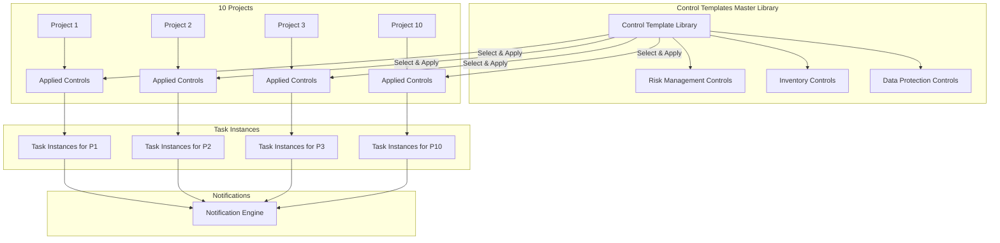

# Multi-Project Compliance Tracker - Enhanced Strategy

## Your Scenario: 10 Projects with Shared & Unique Tasks

### Key Requirements
- **10 Projects** to manage simultaneously
- **Same control tasks** apply to multiple projects
- **Some tasks are NOT applicable** to certain projects
- **Each project** has its own timeline and team
- Need to track which tasks are near to due date from which projects

## Problem Statement

```
Example Scenario:
┌─────────────────────────────────────────────────────────────┐
│ Control: "Review risk log with management" (Monthly)        │
├─────────────────────────────────────────────────────────────┤
│ Project A: ✅ Applicable - Due 15th of each month           │
│ Project B: ✅ Applicable - Due 20th of each month           │
│ Project C: ❌ Not Applicable - No risk management needed    │
│ Project D: ✅ Applicable - Due 10th of each month           │
│ ... (6 more projects)                                        │
└─────────────────────────────────────────────────────────────┘
```

## Recommended Solution: Template-Based Multi-Project System

### Architecture Overview



## Enhanced Data Model

### 1. Projects Table (NEW)
```typescript
interface Project {
  id: string;
  name: string;                      // "Project Alpha", "Project Beta"
  code: string;                      // "PROJ-001", "PROJ-002"
  description: string;
  startDate: Date;
  endDate?: Date;
  status: 'active' | 'on-hold' | 'completed' | 'archived';
  teamMembers: string[];             // ["DPE", "PM", "SE"]
  client?: string;
  createdAt: Date;
  updatedAt: Date;
}
```

### 2. Control Templates Table (Master Library)
```typescript
interface ControlTemplate {
  id: string;
  title: string;                     // "Review risk log with management"
  description: string;               // Full guidance
  controlCode: string;               // "RSK 3.1"
  category: string;                  // "Risk Management"
  frequencyType: 'event-driven' | 'scheduled' | 'both';
  eventTrigger?: string;
  scheduledFrequency?: 'monthly' | 'quarterly' | 'annually' | 'ongoing';
  defaultAssignees: string[];        // Default team roles
  evidenceRequired: boolean;
  isActive: boolean;                 // Can be disabled globally
  createdAt: Date;
  updatedAt: Date;
}
```

### 3. Project Controls Table (Applicability Mapping)
```typescript
interface ProjectControl {
  id: string;
  projectId: string;                 // Foreign key to Project
  controlTemplateId: string;         // Foreign key to ControlTemplate
  isApplicable: boolean;             // ✅ or ❌
  applicabilityReason?: string;      // Why not applicable
  customFrequency?: string;          // Override default frequency
  customDueDay?: number;             // e.g., 15th vs 20th of month
  assignedTo: string[];              // Project-specific team
  evidenceLocation: string;          // Project-specific location
  notes?: string;
  createdAt: Date;
  updatedAt: Date;
}
```

### 4. Task Instances Table (Actual Occurrences)
```typescript
interface TaskInstance {
  id: string;
  projectControlId: string;          // Foreign key to ProjectControl
  projectId: string;                 // Denormalized for quick queries
  controlTemplateId: string;         // Denormalized for quick queries
  instanceLabel: string;             // "Jan'26", "Q1'26"
  plannedDate: Date;
  actualDate?: Date;
  status: 'pending' | 'completed' | 'overdue' | 'not-applicable' | 'skipped';
  completionNotes?: string;
  evidenceUploaded: boolean;
  remindersSent: Date[];
  createdAt: Date;
  updatedAt: Date;
}
```

## How It Works: Step-by-Step

### Step 1: Create Master Control Library
```
1. Import your Excel file
2. Extract unique control objectives
3. Create control templates (one-time setup)
4. Define default frequencies and assignments

Result: Master library of ~50-100 control templates
```

### Step 2: Set Up Projects
```
For each of your 10 projects:
1. Create project record
2. Define project team
3. Set project timeline
4. Specify evidence storage location

Result: 10 project records
```

### Step 3: Apply Controls to Projects
```
For each project:
1. Review master control library
2. Mark which controls are applicable
3. Customize frequency if needed (e.g., 15th vs 20th)
4. Assign project-specific team members
5. Set project-specific evidence location

Result: ~50-100 controls × 10 projects = 500-1000 project-control mappings
(but many marked as "not applicable")
```

### Step 4: Generate Task Instances
```
For each applicable project-control:
1. Calculate due dates based on frequency
2. Generate monthly/quarterly/annual instances
3. Create reminders for each instance

Result: Thousands of task instances across all projects
```

## User Interface Design

### 1. Multi-Project Dashboard

```
┌─────────────────────────────────────────────────────────────┐
│  DS&P Compliance Tracker - All Projects                     │
├─────────────────────────────────────────────────────────────┤
│                                                              │
│  📊 Portfolio Overview                                       │
│  ┌──────────────────────────────────────────────────────┐  │
│  │ Active Projects: 10                                   │  │
│  │ Total Controls: 87                                    │  │
│  │ Applicable Controls: 623                              │  │
│  │ Tasks Due This Week: 23                               │  │
│  │ Overdue Tasks: 5                                      │  │
│  └──────────────────────────────────────────────────────┘  │
│                                                              │
│  🎯 Projects At Risk                                        │
│  ┌──────────────────────────────────────────────────────┐  │
│  │ 🔴 Project Alpha - 3 overdue tasks                    │  │
│  │ 🟠 Project Beta - 5 tasks due this week               │  │
│  │ 🟢 Project Gamma - All on track                       │  │
│  └──────────────────────────────────────────────────────┘  │
│                                                              │
│  📋 My Tasks Across All Projects                            │
│  ┌──────────────────────────────────────────────────────┐  │
│  │ ⚠️ [Project Alpha] Review risk log - May'26          │  │
│  │    Due: 15-Jun-26 (7 days) | Assigned: You           │  │
│  │    [Complete] [View]                                  │  │
│  ├──────────────────────────────────────────────────────┤  │
│  │ 🔔 [Project Beta] Update Asset inventory - Mar'26    │  │
│  │    Due: 31-Mar-26 (13 days) | Assigned: You, PM      │  │
│  │    [Complete] [View]                                  │  │
│  └──────────────────────────────────────────────────────┘  │
└─────────────────────────────────────────────────────────────┘
```

### 2. Project-Specific View

```
┌─────────────────────────────────────────────────────────────┐
│  Project: Alpha (PROJ-001)                                   │
│  Status: Active | Team: DPE, PM, SE | Client: Acme Corp     │
├─────────────────────────────────────────────────────────────┤
│                                                              │
│  📊 Project Compliance Status                                │
│  ┌──────────────────────────────────────────────────────┐  │
│  │ Applicable Controls: 67 / 87 (77%)                   │  │
│  │ Completed Tasks: 45 / 67 (67%)                        │  │
│  │ Overdue: 3 | Due This Week: 5 | Upcoming: 14         │  │
│  └──────────────────────────────────────────────────────┘  │
│                                                              │
│  🎯 Control Categories                                       │
│  ┌──────────────────────────────────────────────────────┐  │
│  │ ✅ Risk Management (RSK)        12/15 (80%)          │  │
│  │ ⚠️ Inventory (INV)              8/12 (67%)           │  │
│  │ ✅ Data Protection (DIP)        25/28 (89%)          │  │
│  │ ❌ Access Control (ACC)         Not Applicable       │  │
│  └──────────────────────────────────────────────────────┘  │
│                                                              │
│  📅 Upcoming Tasks                                           │
│  [Filter: All | Applicable Only | Not Applicable]           │
│                                                              │
│  ✅ Review risk log - May'26 (Completed 19-May-26)          │
│  ⚠️ Review risk log - Jun'26 (Due: 15-Jun-26)               │
│  📅 Client approval - Q2'26 (Due: 30-Jun-26)                │
│  ❌ Security audit (Not Applicable - No PII data)           │
└─────────────────────────────────────────────────────────────┘
```

### 3. Control Template Management

```
┌─────────────────────────────────────────────────────────────┐
│  Control Template Library                                    │
├─────────────────────────────────────────────────────────────┤
│                                                              │
│  [Search controls...] [+ Add New Control]                   │
│                                                              │
│  📋 Risk Management Controls (15)                            │
│  ┌──────────────────────────────────────────────────────┐  │
│  │ RSK 3.1 - Review risk log with management            │  │
│  │ Frequency: Monthly                                    │  │
│  │ Applied to: 8/10 projects                             │  │
│  │ [Edit] [View Projects] [Bulk Apply]                  │  │
│  ├──────────────────────────────────────────────────────┤  │
│  │ RSK 3.1.1 - Review risk log with client              │  │
│  │ Frequency: Quarterly                                  │  │
│  │ Applied to: 7/10 projects                             │  │
│  │ [Edit] [View Projects] [Bulk Apply]                  │  │
│  └──────────────────────────────────────────────────────┘  │
│                                                              │
│  📋 Inventory Controls (12)                                 │
│  📋 Data Protection Controls (28)                            │
│  📋 Access Control (18)                                      │
└─────────────────────────────────────────────────────────────┘
```

### 4. Applicability Matrix View

```
┌─────────────────────────────────────────────────────────────┐
│  Control Applicability Matrix                                │
├─────────────────────────────────────────────────────────────┤
│                                                              │
│  Control: Review risk log with management (RSK 3.1)         │
│                                                              │
│  ┌────────────┬──────────┬──────────┬─────────────────┐    │
│  │ Project    │ Status   │ Due Day  │ Team            │    │
│  ├────────────┼──────────┼──────────┼─────────────────┤    │
│  │ Alpha      │ ✅ Yes   │ 15th     │ DPE, PM, SE     │    │
│  │ Beta       │ ✅ Yes   │ 20th     │ DPE, PM         │    │
│  │ Gamma      │ ❌ No    │ -        │ -               │    │
│  │ Delta      │ ✅ Yes   │ 10th     │ DPE, SE         │    │
│  │ Epsilon    │ ✅ Yes   │ 15th     │ DPE, PM, SE     │    │
│  │ Zeta       │ ❌ No    │ -        │ -               │    │
│  │ Eta        │ ✅ Yes   │ 25th     │ PM, SE          │    │
│  │ Theta      │ ✅ Yes   │ 15th     │ DPE, PM         │    │
│  │ Iota       │ ✅ Yes   │ 20th     │ DPE, SE         │    │
│  │ Kappa      │ ✅ Yes   │ 15th     │ DPE, PM, SE     │    │
│  └────────────┴──────────┴──────────┴─────────────────┘    │
│                                                              │
│  [Bulk Edit] [Export Matrix] [Apply to All]                 │
└─────────────────────────────────────────────────────────────┘
```

## Excel Import Strategy for Multi-Project

### Option 1: Single Excel with Project Column (RECOMMENDED)

```
Add a "Project" column to your existing Excel:

Project | Control Objective | Control Execution Tasks | ... | Planned Date
--------|-------------------|------------------------|-----|-------------
Alpha   | Review risk log   | Monthly review...      | ... | 15-Feb-26
Beta    | Review risk log   | Monthly review...      | ... | 20-Feb-26
Gamma   | N/A               | N/A                    | ... | N/A
Delta   | Review risk log   | Monthly review...      | ... | 10-Feb-26
```

**Import Process:**
1. Upload Excel file
2. System groups by Control Objective
3. Creates control templates (if not exist)
4. Maps to projects based on Project column
5. Marks "N/A" rows as not applicable

### Option 2: Separate Excel per Project

```
Upload 10 Excel files:
- Project_Alpha_SPL2.1.xlsm
- Project_Beta_SPL2.1.xlsm
- Project_Gamma_SPL2.1.xlsm
- ... (7 more)
```

**Import Process:**
1. Upload first Excel → Creates control templates
2. Upload subsequent Excels → Matches to existing templates
3. System auto-detects which controls are in each file
4. Missing controls marked as "not applicable"

### Option 3: Master Template + Project Overrides

```
1. Upload master control template (all possible controls)
2. For each project, upload applicability matrix
3. System applies controls to projects based on matrix
```

## Notification Strategy for Multi-Project

### Challenge: Notification Overload
With 10 projects, you could get 100+ notifications per day!

### Solution: Smart Aggregation

#### 1. Daily Digest (Morning)
```
🔔 Good Morning! Your Compliance Summary

📊 Portfolio Status:
- 5 tasks due today across 3 projects
- 12 tasks due this week
- 2 overdue tasks requiring attention

🚨 Urgent (Due Today):
1. [Project Alpha] Review risk log - May'26
2. [Project Beta] Update Asset inventory - Mar'26
3. [Project Delta] Client approval - Q2'26

⚠️ This Week:
- 4 tasks for Project Alpha
- 3 tasks for Project Beta
- 5 tasks for Project Epsilon

[View Full Dashboard] [Snooze All] [Mark Multiple Complete]
```

#### 2. Project-Specific Notifications
```
🔔 Project Alpha - Task Due Soon

Control: Review risk log with management
Task: Jun'26 Monthly Review
Due: 15-Jun-26 (3 days)

This is 1 of 5 tasks due this week for Project Alpha

[View Project Dashboard] [Complete] [Snooze]
```

#### 3. Notification Preferences
```typescript
interface NotificationPreferences {
  aggregateByProject: boolean;        // Group by project
  dailyDigestTime: string;            // "09:00"
  individualReminders: boolean;       // Also send individual
  reminderDays: number[];             // [30, 14, 7, 3, 1]
  quietHours: {
    enabled: boolean;
    start: string;                    // "20:00"
    end: string;                      // "08:00"
  };
  channels: {
    desktop: boolean;
    email: boolean;
    slack: boolean;
  };
  projectFilters: string[];           // Only notify for specific projects
}
```

## Bulk Operations

### 1. Bulk Apply Controls
```
Select multiple projects → Apply control template → Set frequency
Example: Apply "Review risk log" to Projects Alpha, Beta, Delta, Epsilon
```

### 2. Bulk Update Due Dates
```
Select control across projects → Update due day
Example: Change all "Review risk log" from 15th to 20th
```

### 3. Bulk Mark Complete
```
Select multiple task instances → Mark as complete
Example: Mark all "Jan'26" tasks as complete across all projects
```

### 4. Bulk Export
```
Export options:
- All projects
- Selected projects
- Single project
- By control category
- By date range
```

## Reporting & Analytics

### 1. Portfolio Compliance Report
```
Overall Compliance Rate: 78%

By Project:
- Project Alpha: 85% (57/67 controls)
- Project Beta: 72% (48/67 controls)
- Project Gamma: 90% (45/50 controls)
- ... (7 more)

By Control Category:
- Risk Management: 82%
- Inventory: 75%
- Data Protection: 88%
- Access Control: 70%
```

### 2. Trend Analysis
```
Completion Rate Over Time:
Jan'26: 65%
Feb'26: 70%
Mar'26: 75%
Apr'26: 78%
May'26: 80%

Projects Improving: Alpha, Delta, Epsilon
Projects Declining: Beta, Zeta
```

### 3. Team Workload
```
DPE: 45 tasks this month across 8 projects
PM: 38 tasks this month across 10 projects
SE: 52 tasks this month across 9 projects

Overloaded: SE (52 tasks)
Balanced: PM (38 tasks)
Light: DPE (45 tasks)
```

## Implementation Phases (Updated)

### Phase 1: Core Multi-Project Backend (Week 1-2)
- [x] Set up database with Projects, Control Templates, Project Controls
- [x] Build CRUD APIs for all entities
- [x] Implement template-based control system
- [x] Create applicability mapping logic

### Phase 2: Excel Import for Multi-Project (Week 2)
- [x] Build parser for single Excel with project column
- [x] Support multiple Excel files (one per project)
- [x] Auto-detect control templates
- [x] Map controls to projects
- [x] Handle "not applicable" cases

### Phase 3: Multi-Project UI (Week 3)
- [x] Portfolio dashboard
- [x] Project-specific views
- [x] Control template library
- [x] Applicability matrix
- [x] Bulk operations interface

### Phase 4: Smart Notifications (Week 3-4)
- [x] Daily digest aggregation
- [x] Project-specific notifications
- [x] Notification preferences
- [x] Desktop + Email + Slack

### Phase 5: Reporting & Analytics (Week 4)
- [x] Portfolio compliance reports
- [x] Trend analysis
- [x] Team workload reports
- [x] Export functionality

### Phase 6: Testing & Deployment (Week 5)
- [x] Import all 10 projects
- [x] Test notification aggregation
- [x] Verify bulk operations
- [x] User acceptance testing
- [x] Deploy to production

## Estimated Effort

| Component | Complexity | Time |
|-----------|------------|------|
| Multi-project data model | High | 1 week |
| Template-based controls | Medium | 3 days |
| Excel import (multi-project) | High | 1 week |
| Portfolio dashboard | Medium | 1 week |
| Smart notifications | High | 1 week |
| Bulk operations | Medium | 3 days |
| Reporting | Medium | 3 days |
| Testing & deployment | Medium | 1 week |
| **Total** | | **6-7 weeks** |

## Key Benefits of This Approach

✅ **Scalability**: Easily add more projects  
✅ **Flexibility**: Each project can customize controls  
✅ **Efficiency**: Bulk operations save time  
✅ **Clarity**: Clear applicability tracking  
✅ **Reduced Noise**: Smart notification aggregation  
✅ **Reusability**: Control templates used across projects  
✅ **Compliance**: Easy to prove which controls apply where  

## Next Steps

1. **Confirm this approach** matches your needs
2. **Clarify**:
   - Do all 10 projects have the same Excel structure?
   - Do you want one Excel with project column or separate files?
   - Should we import all 10 projects at once or gradually?
3. **Approve to proceed** to implementation

---

**This enhanced strategy handles your multi-project scenario with task applicability tracking!** 🚀