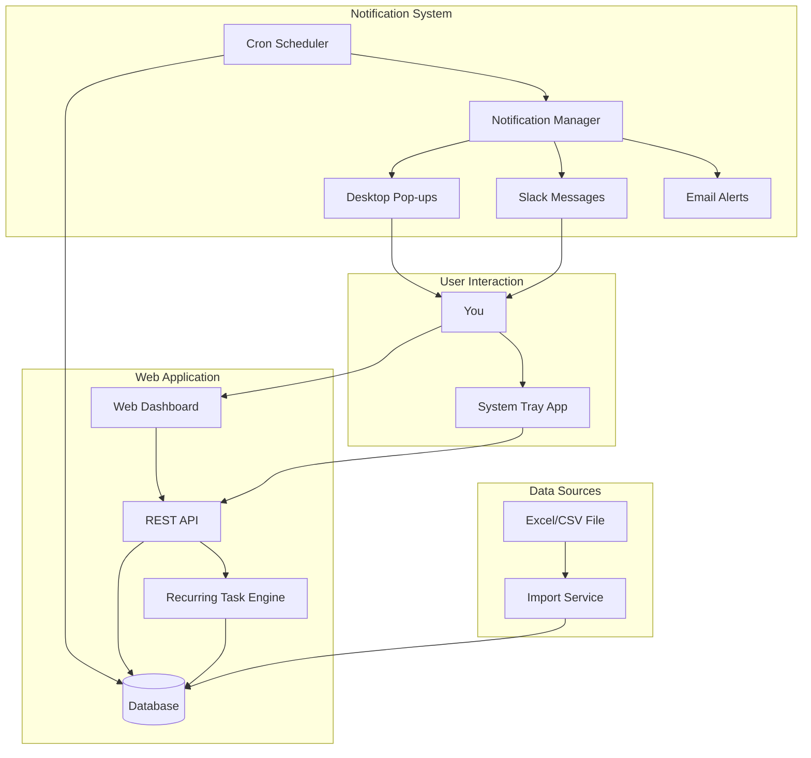

# Task Tracker Notification System - Solution Recommendation

## Your Requirements Analysis

### Current Situation
- **11 Projects** to manage
- **Recurring Tasks**: Monthly, Quarterly, Annually, Ongoing
- **Task Tracker**: Excel/CSV file with tasks and due dates
- **Need**: Automated reminders for high-priority tasks
- **Reminder Schedule**: 10 days before + every 2 days

### Key Challenges
1. Managing multiple projects simultaneously
2. Tracking recurring tasks (monthly/quarterly/annually)
3. Prioritizing tasks across all projects
4. Syncing with existing Excel/CSV tracker
5. Getting timely notifications for upcoming deadlines

## Recommended Solution: **Hybrid Approach**

### 🎯 Best Solution: Web App + Desktop Notifications + Excel Import

**Why this combination?**

| Feature | Web App | Desktop Bot | Hybrid ✅ |
|---------|---------|-------------|-----------|
| Manage 11 projects | ✅ Excellent | ❌ Difficult | ✅ Excellent |
| Recurring tasks | ✅ Built-in | ⚠️ Manual | ✅ Built-in |
| Priority management | ✅ Visual | ❌ Limited | ✅ Visual |
| Excel/CSV import | ✅ Easy | ⚠️ Manual | ✅ Easy |
| Desktop notifications | ❌ Email only | ✅ Native | ✅ Both |
| Slack integration | ✅ Yes | ✅ Yes | ✅ Yes |
| Task overview | ✅ Dashboard | ❌ CLI only | ✅ Dashboard |
| Quick updates | ⚠️ Need browser | ✅ Fast | ✅ Both |

### Architecture Overview



## Solution Components

### 1. Web Dashboard (Primary Interface)
**Purpose**: Manage all 11 projects and tasks

**Features**:
- 📊 **Project Overview**: See all 11 projects at a glance
- 📅 **Calendar View**: Monthly/quarterly/annual tasks visualization
- 🎯 **Priority Dashboard**: High-priority tasks front and center
- 📈 **Progress Tracking**: Task completion rates per project
- 🔄 **Recurring Task Management**: Set up monthly/quarterly/annual tasks
- 📥 **Excel Import**: Upload your CSV/Excel file
- 📤 **Excel Export**: Download updated tracker
- 🔍 **Search & Filter**: Find tasks by project, priority, date
- ✏️ **Quick Edit**: Update tasks, mark complete, change dates

**Why Web Dashboard?**
- ✅ Perfect for managing complex multi-project scenarios
- ✅ Visual overview of all tasks and priorities
- ✅ Easy to set up recurring tasks
- ✅ Can access from any device
- ✅ Better for bulk operations

### 2. Desktop Notification Agent (Background Service)
**Purpose**: Send timely reminders

**Features**:
- 🔔 **Native Pop-ups**: Windows/Mac/Linux notifications
- 🎯 **Smart Prioritization**: Shows highest priority task first
- ⏰ **Scheduled Reminders**: 10 days before + every 2 days
- 🔕 **Snooze Options**: Delay reminder if busy
- ✅ **Quick Actions**: Mark complete from notification
- 🖥️ **System Tray Icon**: Quick access to today's tasks
- 🔄 **Auto-sync**: Checks web app every hour

**Why Desktop Agent?**
- ✅ Impossible to miss notifications
- ✅ Works even when browser is closed
- ✅ Lightweight background process
- ✅ Quick actions without opening browser

### 3. Slack Integration (Optional)
**Purpose**: Team visibility and mobile access

**Features**:
- 💬 **Daily Digest**: Morning summary of today's tasks
- 🚨 **Urgent Alerts**: High-priority task reminders
- ✅ **Quick Commands**: `/task complete`, `/task list`
- 📊 **Weekly Summary**: Project progress reports

## Excel/CSV Integration

### Expected File Format

```csv
Project,Task,Description,Priority,Due Date,Frequency,Status
Project A,Monthly Report,Submit monthly report,High,2026-06-01,Monthly,Pending
Project A,Quarterly Review,Conduct quarterly review,High,2026-06-30,Quarterly,Pending
Project B,Client Meeting,Weekly client sync,Medium,2026-05-20,Weekly,Pending
Project C,Annual Audit,Complete annual audit,Critical,2026-12-31,Annually,Pending
```

### Import Process
1. **Upload CSV**: Drag & drop or select file
2. **Map Columns**: System auto-detects or you map manually
3. **Review**: Preview tasks before import
4. **Import**: Tasks added to database
5. **Recurring Setup**: System creates future instances

### Recurring Task Handling

**Monthly Tasks** (e.g., "Monthly Report"):
- Creates 12 instances for the year
- Each with appropriate due date
- Automatically generates next month's task when completed

**Quarterly Tasks** (e.g., "Quarterly Review"):
- Creates 4 instances for the year
- Q1: March 31, Q2: June 30, Q3: Sept 30, Q4: Dec 31

**Annual Tasks** (e.g., "Annual Audit"):
- Creates one instance per year
- Automatically creates next year's task when completed

**Ongoing Tasks**:
- Remains active until manually completed
- Can set custom reminder frequency

## Priority Management System

### Priority Levels
1. **Critical** 🔴: Must complete on time
2. **High** 🟠: Important, slight flexibility
3. **Medium** 🟡: Normal priority
4. **Low** 🟢: Can be delayed if needed

### Smart Notification Logic

```
Priority Score = (Priority Level × 10) + (Days Until Due × -1)

Example:
- Critical task due in 2 days: (4 × 10) + (-2) = 38
- High task due in 5 days: (3 × 10) + (-5) = 25
- Medium task due tomorrow: (2 × 10) + (-1) = 19

→ Critical task gets notified first
```

### Notification Strategy

**10 Days Before**:
- All Critical and High priority tasks
- Desktop notification + Slack message

**Every 2 Days**:
- Repeat for Critical and High
- Medium priority starts at 5 days before

**Daily (Last 3 Days)**:
- All priorities get daily reminders
- More urgent tone in notifications

**Overdue**:
- Hourly reminders for Critical
- Every 4 hours for High
- Daily for Medium/Low

## Implementation Recommendation

### Phase 1: Core Web App (Week 1-2)
1. Set up React + Express + SQLite
2. Build project and task management
3. Implement Excel/CSV import
4. Create dashboard with project overview
5. Add recurring task engine

### Phase 2: Notification System (Week 2-3)
1. Build notification scheduler
2. Implement priority calculation
3. Add desktop notification agent
4. Create system tray app
5. Test reminder timing

### Phase 3: Slack Integration (Week 3-4)
1. Set up Slack app
2. Implement bot commands
3. Add daily digest
4. Test notifications

### Phase 4: Polish & Deploy (Week 4)
1. Add Excel export
2. Create user documentation
3. Set up auto-start for desktop agent
4. Deploy and test with real data

## Technology Stack

### Web Application
- **Frontend**: React + TypeScript + Vite
- **Backend**: Node.js + Express
- **Database**: SQLite (simple) or PostgreSQL (scalable)
- **Styling**: Tailwind CSS or Material-UI

### Desktop Agent
- **Runtime**: Node.js
- **Notifications**: node-notifier
- **System Tray**: electron or node-systray
- **Scheduler**: node-cron

### Integrations
- **Excel/CSV**: papaparse or xlsx
- **Slack**: @slack/bolt
- **Email**: nodemailer (optional)

## File Structure

```
task-tracker-system/
├── backend/
│   ├── src/
│   │   ├── routes/
│   │   │   ├── projects.ts
│   │   │   ├── tasks.ts
│   │   │   ├── import.ts
│   │   │   └── notifications.ts
│   │   ├── services/
│   │   │   ├── taskService.ts
│   │   │   ├── recurringTaskService.ts
│   │   │   ├── priorityService.ts
│   │   │   └── notificationService.ts
│   │   ├── scheduler/
│   │   │   └── reminderScheduler.ts
│   │   └── index.ts
│   └── package.json
├── frontend/
│   ├── src/
│   │   ├── components/
│   │   │   ├── Dashboard.tsx
│   │   │   ├── ProjectList.tsx
│   │   │   ├── TaskCalendar.tsx
│   │   │   ├── PriorityView.tsx
│   │   │   └── ImportWizard.tsx
│   │   └── App.tsx
│   └── package.json
├── desktop-agent/
│   ├── src/
│   │   ├── notifier.ts
│   │   ├── trayApp.ts
│   │   └── index.ts
│   └── package.json
└── docker-compose.yml
```

## Sample Excel Template

I'll provide a template Excel file with:
- All 11 projects pre-configured
- Common task templates
- Priority guidelines
- Frequency options
- Instructions sheet

## Comparison: Final Recommendation

### Option A: Web App Only
**Pros**: Easy to manage, good overview  
**Cons**: Must keep browser open, easy to miss notifications  
**Best For**: Office workers always at desk

### Option B: Desktop Bot Only
**Pros**: Never miss notifications, lightweight  
**Cons**: Hard to manage 11 projects, no visual overview  
**Best For**: Simple task lists, single project

### Option C: Hybrid (RECOMMENDED) ✅
**Pros**: Best of both worlds, comprehensive solution  
**Cons**: Slightly more complex setup  
**Best For**: Your exact use case - 11 projects with recurring tasks

## Why Hybrid is Best for You

1. **Project Management**: Web dashboard perfect for 11 projects
2. **Recurring Tasks**: Built-in engine handles monthly/quarterly/annual
3. **Excel Integration**: Easy import/export workflow
4. **Priority Focus**: Dashboard shows high-priority tasks prominently
5. **Reliable Notifications**: Desktop agent ensures you never miss deadlines
6. **Flexibility**: Update tasks via web or quick actions from tray
7. **Scalability**: Can add more projects easily
8. **Backup**: Excel export keeps your data portable

## Next Steps

1. **Review this recommendation**
2. **Confirm the hybrid approach**
3. **Share a sample of your Excel file** (I'll design import to match)
4. **Decide on Slack integration** (optional but recommended)
5. **Start implementation** in Advanced mode

## Estimated Timeline

- **Setup & Core Features**: 2 weeks
- **Testing with Your Data**: 3-5 days
- **Refinement**: 3-5 days
- **Total**: ~3 weeks to fully functional system

## Cost Comparison

**Building Custom Solution**:
- Development time: ~3 weeks
- Maintenance: Minimal (you own the code)
- Hosting: Free (local) or $5-10/month (cloud)
- **Total**: One-time development

**Using Existing Tools**:
- Asana/Jira: $10-20/user/month
- Todoist Premium: $4/month
- Microsoft Project: $10-55/month
- **Total**: $120-660/year ongoing

**Recommendation**: Build custom - pays for itself in 3-6 months!